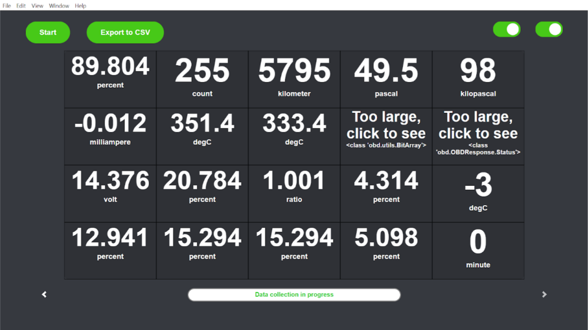
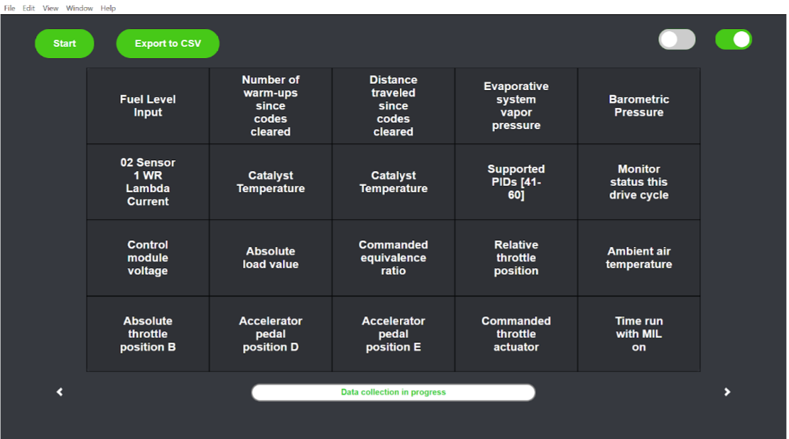
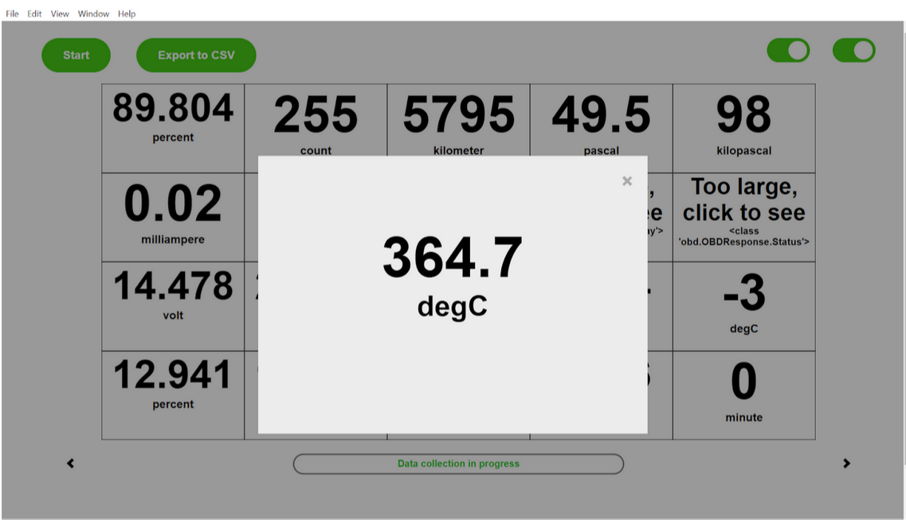

# ElectronOBD
#### Demo video: Coming soon
## What is it

<p float="left">
  </img>
  </img>
  </img>
</p>

ElectronOBD is a simple, but modern-style desktop app I made for displaying real-time ECU sensor data from my sedan to a laptop screen with CSV file export option for machine learning tasks. You can see a sample CSV file [here](https://github.com/8ahmedanwer8/ElectronOBD/blob/main/promo_stuff/ElectronOBD%2012-21-21-00-20-17.csv) with my data when I was driving around the block. It is only supported on Windows for now and not packaged into an .exe file (I think it's better to run it from command line anyway), but I was able to get the results I wanted from it and so I thought it was a good time to post this repo. The real magic happens thanks to the [Python-OBD API](https://python-obd.readthedocs.io/en/latest/) which interfaces with the car via its OBD-II port from the laptop's serial port, and retrieves data every second. My work here was creating a fullstack electron app to make the process more user-friendly, free and targeted towards AI. Only thing to buy is the actual OBD-II USB adapter, which should be compatible with most cars, but you can read more about that online.

## The motivation behind it
For some uni work I was doing, I needed a way to log and export ECU data from my KIA Forte into a nice CSV file format. All OBD softwares online seemed to have some kind of a paywall. So I decided to make my own open-source desktop app. At first I considered using an OBD-II Bluetooth adapter with OBD apps on the Playstore. But, this would not have allowed for CSV file export with Pandas and any other customization I may have wanted. Data rate for bluetooth can also be slow and unreliable sometimes. That's why I chose a direct-wired connection to my laptop with this OBD-II to USB [adapter](https://www.amazon.ca/gp/product/B07THHVLR2/ref=ppx_yo_dt_b_asin_title_o04_s01?ie=UTF8&psc=1) (not amazon affiliate link). Finally, I found Python-OBD, which is a great library that handles low-level communication between the computer and car via the ELM-327 microcontroller inside the OBD-II adapter. The adapter itself is capable of HS-CAN and MS-CAN, but I found MS-CAN wasn't being recognized by Py-OBD, but HS-CAN got the job done.

## Setup
This setup procedure will likely go through edits as I test ElectronOBD on more Windows devices, but below is what I have so far. I'm also assuming the reader is familiar with programming and downloading things, but not familar with downloading and using github projects. If any trouble, the internet should have the answers.

1) First you should install the dependencies. Install Python 3 and the Python Pandas library. Python 3 can be installed from python.org and then pandas can be installed from the command prompt by typing in ```pip install pandas```. You can also download Pandas from https://pandas.pydata.org/, but installing it with pip in the CMD is quicker.

2) The next and final dependency is Node.js. You can install Node from https://nodejs.org/en/. 

3) Now you can clone this repo and save it somewhere in your computer. Then copy the directory of where it is and paste it into CMD like this ```cd directory``` where directory is the path to the project. 

4) Now when you are in the directory in your CMD (it should say the directory name and you should be able to type whatever you want), type ```npm install```. This should install the electron app dependencies. When that is done, type ```npm start```  to start ElectronOBD.

5) Now before collecting data, you should probably exit out of the app and type ```test.py```. This is a script that tests if sensor data is actually readable from the car and whether the OBD-II connection is up and running. If test.py does not run as described in the code, something probably needs to be corrected. The error logs should help with that. 

6) If test.py runs as it should and you saw RPM values printed to the console/CMD, then you can ```npm start``` the app and begin data acquisition. The status bar in the bottom should help with what's going on in the backgorund. First ElectronOBD finds all compatible sensors, their units of measurment and their names, then it begins reading and displaying those values. After you are done collecting data, click Export to CSV and a CSV file in your desktop should appear. 

## Troubleshooting
This section will probably also go through edits as I test ElectronOBD on other laptops and people actually start to use this thing if they do.
- Make sure test.py works properly.
- Sometimes Python-OBD does not connect to your laptop's serial port properly if you have your car's bluetooth speaker connected to your phone. (Interesting, right?). Check device manager on Windows and under Serial Ports, see if your OBD-II USB serial connection is visible.
- If Electron-OBD is displaying a black screen (after displaying the welcome page) but you can see data being printed to the console, then restart the app and try again.

## The future
I want to make this compatible with my NVIDIA Jetson Nano and that would've been pretty simple, but the issue is that its processor is an ARM core processor which causes issues with Electron.js since it's not made to work with ARM processors. Besides that, I think adding ML models in the python backend that predict using the real-time car data would also be cool and you could display those predictions on a Flask web app or something. Also, I hope the code isn't too hard to modify or understand. One thing I had trouble with was IPC between Python and Node.js, but I got through it thanks to lovely internet communities.
Ideally, I just want to see people using this to do cool things with their car data or just collecting data for fun. Self-driving cars don't use internal sensor data I believe, but maybe this could help with that some day if possible.


